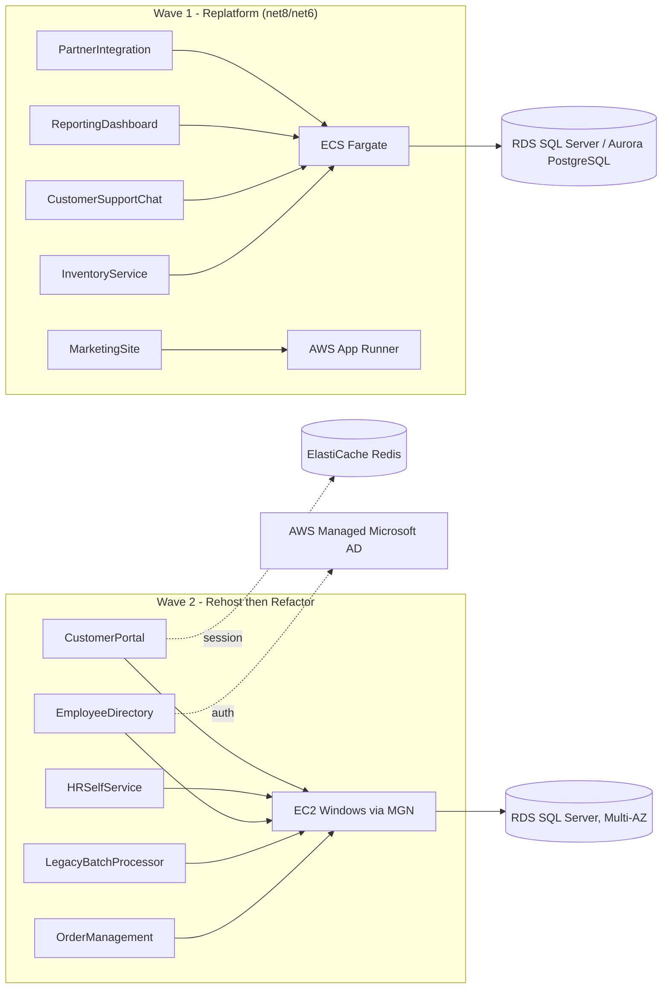

# .NET Application Portfolio — AWS Migration Assessment Report (Sample)

| | |
|---|---|
| **Client** | Acme Corp *(fictional sample client, used to illustrate report structure)* |
| **Portfolio scope** | 10 internally-hosted .NET applications |
| **Assessment method** | Automated scan (`Assess-DotNetApplications.ps1`) + manual validation |
| **Report status** | Sample / template — replace data with a real portfolio scan before client delivery |

> **How to reproduce this report:** run `Assess-DotNetApplications.ps1 -Path <source-root> -UseIIS -IncludeSourceScan` against the real portfolio. Every score and recommendation below was generated by that script against a synthetic 10-app test portfolio, not invented by hand — the numbers are internally consistent with the tool's scoring model described in Section 7.

---

## 1. Executive Summary

Acme Corp's 10 in-scope .NET applications split roughly in half between legacy **.NET Framework** apps (5) tied to Windows/IIS and stateful session handling, and modern **.NET 8/6** apps (5) that are already close to cloud-native. The portfolio's overall "stickiness" is driven by three recurring patterns: **in-process session state** (3 apps), **Windows Authentication / AD dependency** (3 apps), and **Windows-only or COM-based dependencies** (5 apps, including one COM+ enterprise-services app).

**Recommendation:** a two-track migration —
- **Track A (5 apps, Replatform):** move the already-modern .NET Core/.NET 8 apps straight to **ECS Fargate / AWS App Runner** with minimal changes. These are the fastest wins and should be Wave 1.
- **Track B (5 apps, Rehost → Refactor):** lift-and-shift the .NET Framework apps to **EC2 (Windows) via AWS Application Migration Service (MGN)** first to de-risk the move off current infrastructure, then run a second-phase refactor to externalize session state (ElastiCache) and, where feasible, port to .NET 8 on Linux containers.

No apps in this sample were flagged **Retire** or **Retain** — those calls require business input (usage, criticality, planned decommission) that a code/config scan cannot determine; see Section 9.

---

## 2. Methodology

1. **Discovery** — recursive scan of source repositories and (optionally) live IIS for `.csproj`, `web.config`, `packages.config`, and `*.runtimeconfig.json`.
2. **Fingerprinting** — per app: target framework, session-state mode, authentication mode, database provider, COM/Windows-only dependencies, platform target (x86/x64), and (optional deep scan) hardcoded file-system paths.
3. **Scoring** — a **Readiness score** (cloud-native fit, 0–100) and a **Stickiness score** (coupling to current infrastructure, 0–100) computed from weighted flags.
4. **Recommendation** — each app mapped to one of the AWS **7 Rs** (Rehost, Replatform, Refactor, Repurchase, Retire, Retain, Relocate) and a suggested AWS target service.
5. **Validation (manual, not automated)** — findings reviewed with app owners to confirm usage/criticality and catch anything a static scan misses (e.g., undocumented integrations, actual traffic patterns).

---

## 3. Application Inventory & Findings

| App | Framework | Target | Platform | Session State | Auth | DB | COM? | Win-only Deps | Local FS Dep? | Stickiness | Readiness |
|---|---|---|---|---|---|---|---|---|---|---|---|
| CustomerPortal | .NET Framework | net48 | x86 | InProc | Windows | SQL Server | No | 2 | No | **75** | 0 |
| HRSelfService | .NET Framework | net48 | x86 | InProc | Windows | SQL Server | No | 1 | No | **75** | 0 |
| EmployeeDirectory | .NET Framework | net48 | AnyCPU | InProc | Windows | SQL Server | No | 2 | No | **70** | 0 |
| LegacyBatchProcessor | .NET Framework | net45 | AnyCPU | n/a | n/a | None detected | **Yes** | 1 | **Yes** | **60** | 0 |
| OrderManagement | .NET Framework | net472 | AnyCPU | StateServer | Forms | SQL Server | No | 1 | No | **30** | 25 |
| PartnerIntegration | .NET Core/5+ | net8.0 | AnyCPU | n/a | n/a | MySQL | No | 0 | No | **0** | **90** |
| ReportingDashboard | .NET Core/5+ | netcoreapp3.1 | AnyCPU | n/a | n/a | SQL Server | No | 0 | No | **0** | 80 |
| CustomerSupportChat | .NET Core/5+ | net8.0 | AnyCPU | n/a | n/a | None | No | 0 | No | **0** | 80 |
| MarketingSite | .NET Core/5+ | net8.0 | AnyCPU | n/a | n/a | None | No | 0 | No | **0** | 80 |
| InventoryService | .NET Core/5+ | net6.0 | AnyCPU | n/a | n/a | PostgreSQL | No | 0 | No | **0** | 80 |

**Portfolio-wide stickiness indicators** (from the scan summary):
- InProc session-state apps: **3**
- Windows Authentication apps: **3**
- COM/COM+ interop: **1**
- Windows-only dependencies: **5** apps affected
- 32-bit (x86) platform: **2**
- .NET Framework vs .NET Core/5+: **5 / 5**

⚠️ `ReportingDashboard` targets `netcoreapp3.1`, which is **out of support** — flag for an upgrade to .NET 8 regardless of hosting decision.

---

## 4. 7R Categorization & Rationale

### Replatform — Wave 1 (5 apps)
`PartnerIntegration`, `ReportingDashboard`, `CustomerSupportChat`, `MarketingSite`, `InventoryService`
- Already on .NET Core/.NET 8, no session-state coupling, no Windows-only or COM dependencies.
- `PartnerIntegration` already runs ASP.NET Core behind IIS (ANCM) — dropping IIS in favor of Kestrel directly is a small, low-risk step.
- **Target:** ECS Fargate or AWS App Runner (Linux containers); RDS/Aurora for the SQL Server-backed app, Aurora PostgreSQL-compatible for `InventoryService`.

### Rehost — Wave 2 (5 apps)
`CustomerPortal`, `HRSelfService`, `EmployeeDirectory`, `LegacyBatchProcessor`, `OrderManagement`
- All are .NET Framework with meaningful coupling: InProc session (3), Windows Auth (3), COM+/EnterpriseServices (1), x86 platform target (2), hardcoded file paths (1).
- **Target:** EC2 (Windows) via AWS MGN as the first move — replicate current state without a redesign, to hit a migration deadline without inheriting refactor risk.
- **Second-phase candidates for Refactor** (post-Wave-2, prioritize by business value): `OrderManagement` (lowest stickiness in this group — already externalizes session to StateServer, only needs Forms-auth and SQL Server ported) is the best refactor candidate. `LegacyBatchProcessor`'s COM+ dependency (`Interop.LegacyMailer`) and hardcoded `C:\BatchData\...` path make it the hardest to refactor — budget time to replace the COM component and move file I/O to S3 before attempting a Linux port.

### Retire / Retain
Not determined by this scan — requires usage analytics and business-owner interviews (see Section 9).

---

## 5. Target AWS Architecture

| Concern | Recommendation |
|---|---|
| Session state (3 InProc apps) | Externalize to **ElastiCache (Redis)** during the refactor phase — required before any horizontal auto-scaling |
| Windows Authentication (3 apps) | **AWS Managed Microsoft AD**, trust relationship to on-prem AD if it persists elsewhere |
| SQL Server (7 apps) | Lift-shift to **RDS for SQL Server** initially; evaluate **Aurora PostgreSQL** via AWS SCT/DMS for the biggest licensing-cost reduction where T-SQL compatibility allows |
| COM+/EnterpriseServices (`LegacyBatchProcessor`) | Not portable to Linux as-is; replace `Interop.LegacyMailer` with a managed alternative (e.g., Amazon SES) before attempting a container port |
| Hardcoded file paths | Migrate to **Amazon S3** with an abstraction layer (e.g., `IFileStorage`) before decommissioning the Windows file system dependency |

---

## 6. Migration Wave Plan

| Wave | Apps | Approach | Est. Duration* |
|---|---|---|---|
| 1 | PartnerIntegration, ReportingDashboard, CustomerSupportChat, MarketingSite, InventoryService | Replatform to ECS Fargate/App Runner; RDS/Aurora cutover | 6–8 weeks |
| 2 | CustomerPortal, HRSelfService, EmployeeDirectory, LegacyBatchProcessor, OrderManagement | Rehost to EC2 (Windows) via MGN | 8–10 weeks |
| 3 | OrderManagement (refactor), then remaining Wave-2 apps by priority | Externalize session to ElastiCache; evaluate .NET 8 port | Ongoing, prioritized by business value |

*Illustrative durations — replace with real estimates once app owners confirm scope, test coverage, and cutover windows.*

---

## 7. Scoring Model Reference

Readiness and Stickiness are computed by `Assess-DotNetApplications.ps1` from these weighted signals (see `Get-MigrationRecommendation` in the script):

| Signal | Effect |
|---|---|
| .NET Core/5+ target framework | +30 readiness |
| ASP.NET Core hosted via IIS (`<aspNetCore>`) | +10 readiness |
| COM/COM+ reference | −20 readiness, +25 stickiness |
| Windows-only dependency (e.g. `System.Web`, `System.DirectoryServices`) | −15 readiness, +20 stickiness |
| InProc session state | −15 readiness, +30 stickiness |
| StateServer / SQLServer / Custom session state | small readiness gain, lower stickiness than InProc |
| Windows Authentication | −10 readiness, +20 stickiness |
| x86 platform target | −5 readiness, +5 stickiness |
| Hardcoded local file-system path | −10 readiness, +15 stickiness |

Treat these as a **starting point for discussion**, not a final verdict — validate with app owners before committing a wave plan.

---

## 8. Illustrative Cost Comparison (TCO)

*(Sample figures only — replace with actual current infrastructure costs and AWS Pricing Calculator / Migration Evaluator output.)*

| Cost driver | Current (on-prem/VM) | AWS Wave 1 (Replatform) | AWS Wave 2 (Rehost) |
|---|---|---|---|
| Compute | Fixed VM capacity, sized for peak | Fargate/App Runner, pay-per-use, auto-scales | Right-sized EC2, Reserved Instances after stabilization |
| OS licensing | Windows Server (all 10 apps) | **Eliminated** for 5 Linux-container apps | Retained short-term for Wave 2, revisit after refactor |
| DB licensing | SQL Server Enterprise (7 apps) | Aurora PostgreSQL option for compatible apps | RDS SQL Server initially, Aurora evaluation later |
| Ops overhead | Manual patching/DR per VM | Managed by ECS/Fargate + RDS Multi-AZ | Reduced via MGN-managed cutover + Multi-AZ RDS |

The single largest lever in this portfolio is **SQL Server + Windows Server licensing** on the 5 Wave-2 apps — quantify with AWS Migration Evaluator against actual current spend for the real engagement.

---

## 9. Risk Register

| Risk | Impact | Mitigation |
|---|---|---|
| Retire/Retain decisions not covered by automated scan | Wrong apps migrated, wasted effort | Business-owner interviews + usage telemetry before finalizing wave plan |
| InProc session cutover breaks user sessions mid-migration | User-facing outage during cutover | Externalize to ElastiCache **before** any horizontal scaling or blue/green cutover |
| COM+/EnterpriseServices component (`LegacyBatchProcessor`) has no direct AWS/Linux equivalent | Refactor stalls or ships with hidden bugs | Replace with managed AWS service (e.g., SES for mailer) during refactor design, not during cutover |
| `netcoreapp3.1` app is out of support | Security/compliance exposure | Prioritize framework upgrade to .NET 8 independent of hosting migration |
| Windows Authentication apps need AD reachability | Broken login post-migration | Stand up AWS Managed Microsoft AD / trust relationship and test before cutover, not after |

---

## 10. Why AWS for This Portfolio

- **Migration tooling fit**: AWS Application Migration Service (MGN) for the 5 Wave-2 lift-shift apps, AWS Porting Assistant for .NET for framework-upgrade candidates — purpose-built for exactly this .NET Framework → .NET 8 path.
- **Cost**: eliminating Windows/SQL Server licensing on the 5 already-modern apps (Wave 1) is available immediately; the same option opens up for Wave 2 apps once refactored — AWS is the only path that lets license elimination happen incrementally, per-app, rather than all-or-nothing.
- **Compute breadth matched to stickiness**: EC2 (Windows) for immediate lift-shift, ECS Fargate/App Runner for the cloud-ready apps — no need to force every app into the same target on day one.
- **Concrete de-stickying services**: ElastiCache directly replaces InProc session state; AWS Managed Microsoft AD directly replaces the Windows Auth dependency — both are the actual blockers found in this portfolio, not generic cloud benefits.
- **Honest counterpoint**: Azure App Service offers more turnkey .NET/Windows-auth hosting out of the box. AWS is still the right call here given the emphasis on licensing-cost elimination via Linux containers/Aurora and the maturity of MGN/Porting Assistant for the specific Framework-to-Core migration this portfolio needs — revisit this trade-off if Azure AD/Entra integration is a hard requirement elsewhere in the estate.

---

## 11. Roadmap & Next Steps

1. Validate this scan's findings with each app's engineering/business owner (1–2 weeks).
2. Confirm Retire/Retain candidates using usage data (parallel with step 1).
3. Kick off Wave 1 (Replatform) — lowest risk, fastest AWS cost/licensing win.
4. Run Wave 2 (Rehost via MGN) in parallel once Wave 1 is stable.
5. Sequence Wave 3 refactor work (session externalization, COM+ replacement, framework upgrades) by business value, starting with `OrderManagement`.
6. Re-run `Assess-DotNetApplications.ps1` after each wave to confirm stickiness scores have actually dropped.

---

## Appendix: Raw Scan Output

Full CSV/JSON produced by `Assess-DotNetApplications.ps1 -Path <root> -IncludeSourceScan` is the source of truth for Section 3 — attach `DotNet_AWS_Assessment_<timestamp>.csv` and `.json` from the real scan run as engagement artifacts alongside this report.
